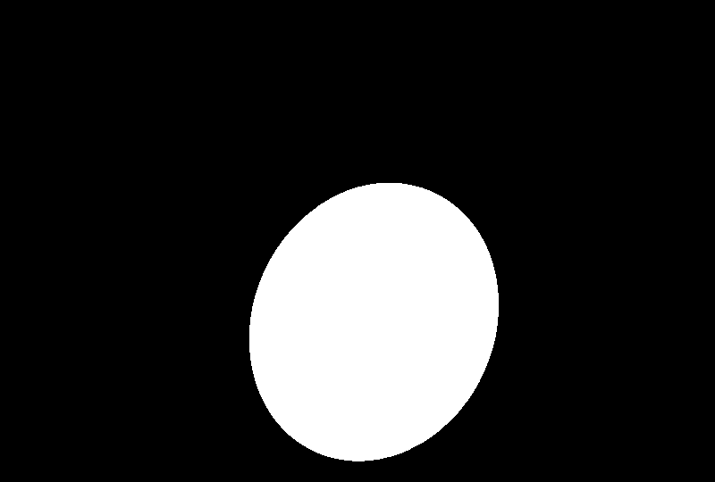

## Overview

### Data

The original dataset is from [
grand-challenge](https://zenodo.org/records/1327317), and I've downloaded it and done the pre-processing.

You can find it in folder data/membrane.

### Model

This deep neural network is implemented with PyTorch.

### Training

The model is trained for 2 epochs (Because of low dataset available).

After 2 epochs, calculated accuracy is about 0.97.

Loss function for the training is basically just a Dice Loss (It is considered one of the best loss function for image segmentation ).

## How to use

### Run fetal_head.py 

You will see the predicted results of test image

### Results

This is the ultrasonic image passed through model.

This is the annotated image converted from input image.

